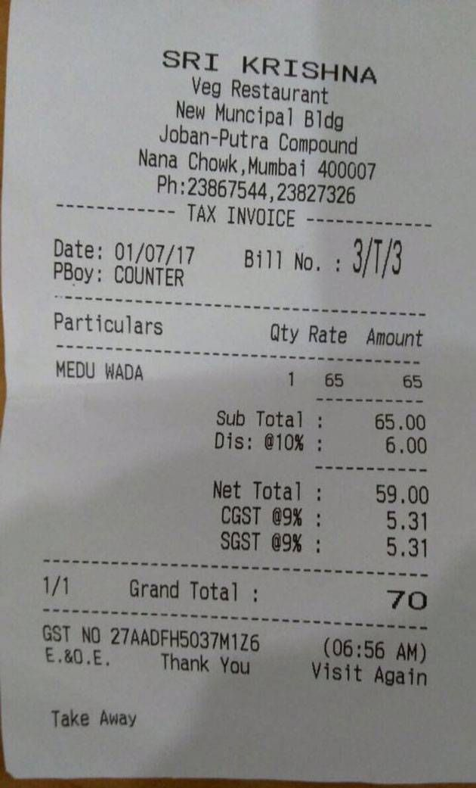
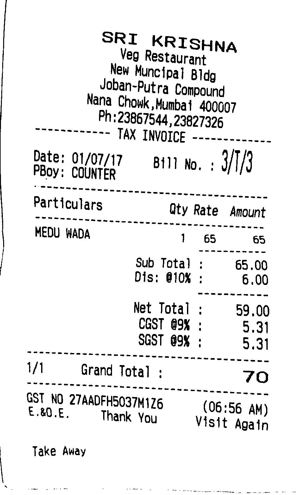

# OCR_Image_to_Text

This project covers:

1. Preprocessing of Image 
2. Image to String Conversion

### Raw Sample Image

### Preprocessing of Image 
Below techniques have been applied to preprocess an image:

> 1. Rescaling the image.
> 2. Converting Image to Gray Scale.
> 3. Eliminating Shadows from the image.
> 4. Dilation and erosion implementation to remove noise.
> 5. Image threshholding to maintain black and white pixel.

### Processed Sample Image

### Image to String Conversion
Python library **tesseract** is used for image to conversion
